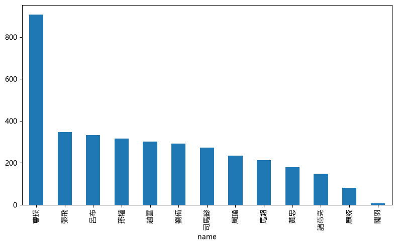
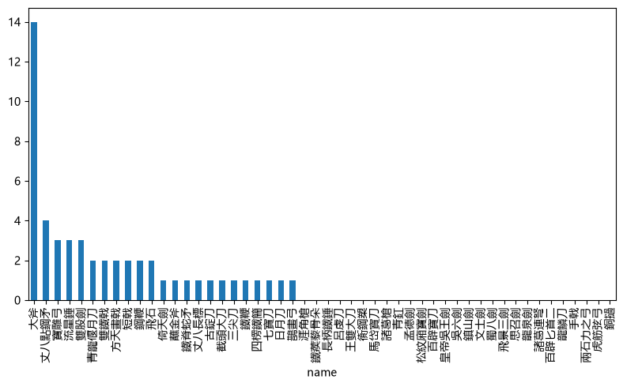

## 这部分是指定类型的频次统计

## 1 词频统计

## 统计文本中，指定人名的次数，步骤：
+ 打开人名的文本
+ 对人名进行列表化处理
+ 打开文本
+ 采用文本跟人名匹配的方式，进行人名统计（注：没有采用采用分词的方式）
+ 用字典存储：人名-频次
+ 画图展示


```python
# 文件的打开与关闭
```


```python
f_name = open('name.txt',encoding = 'GB18030') #使用mac的小伙伴，需要耐心调试下编码GB18030
```


```python
#f_name = open('name.txt')
```


```python
data_name = f_name.read()
```


```python
data_name[:70]
```


    '諸葛亮|關羽|劉備|曹操|孫權|關羽|張飛|呂布|周瑜|趙雲|龐統|司馬懿|黃忠|馬超'


```python
print(data_name[:50])
```

    諸葛亮|關羽|劉備|曹操|孫權|關羽|張飛|呂布|周瑜|趙雲|龐統|司馬懿|黃忠|馬超
    


```python
f_name.close()
```


```python
# 将文本转化为列表
```


```python
names = data_name.split('|') # split一下names就是列表
```


```python
print(names)
```

    ['諸葛亮', '關羽', '劉備', '曹操', '孫權', '關羽', '張飛', '呂布', '周瑜', '趙雲', '龐統', '司馬懿', '黃忠', '馬超']
    


```python
names
```


    ['諸葛亮',
     '關羽',
     '劉備',
     '曹操',
     '孫權',
     '關羽',
     '張飛',
     '呂布',
     '周瑜',
     '趙雲',
     '龐統',
     '司馬懿',
     '黃忠',
     '馬超']


```python
# 学习一种新的数据结构，字典
```


```python
name_dict = {}
```


```python
f_txt = open('sanguo.txt',encoding = 'GB18030')
```


```python
data_txt = f_txt.read()
```


```python
f_txt.close()
```


```python
print(data_txt[:100])
```

    《三国演义》（全）
    
    （明）羅貫中著
    
      
    第一回
    宴桃園豪傑三結義斬黃巾英雄首立功
    話說天下大勢，分久必合，合久必分：周末七國分爭，並
    入于秦；及秦滅之後，楚、漢分爭，又並入於漢；漢朝自高祖
    斬白
    


```python
# 用count函数统计文本中的词汇
```

## 你没有发现下面的代码很神奇吗？data_txt点count一下，就可以统计词！实际上是字符串匹配的过程！


```python
for name in names:
    name_dict[name]=data_txt.count(name)
```


```python
name_dict
```


    {'諸葛亮': 149,
     '關羽': 8,
     '劉備': 291,
     '曹操': 907,
     '孫權': 315,
     '張飛': 347,
     '呂布': 332,
     '周瑜': 235,
     '趙雲': 301,
     '龐統': 80,
     '司馬懿': 272,
     '黃忠': 179,
     '馬超': 212}


```python
# 定义  画图 函数
```


```python
def make_chinese_plot_ready():
    from matplotlib import rcParams
    #rcParams['font.family'] = 'Heiti TC' # mac笔记本电脑直接替换字体
    rcParams['font.sans-serif'] = ['Microsoft YaHei'] # 或者直接使用电脑有的字体 FangSong
    rcParams['axes.unicode_minus'] = False
```


```python
# 定义 画图 函数
```


```python
def draw_dict(mydict, figsize=(8, 5)):
    import pandas as pd
    import matplotlib.pyplot as plt
    make_chinese_plot_ready()
    df = pd.DataFrame(list(mydict.items()), columns=['name', 'times'])
    df.set_index('name')['times'].sort_values(ascending=False).plot(kind='bar', figsize=figsize)  # 做好排序
    plt.tight_layout() 
```


```python
 # %pylab inline
```


```python
%matplotlib inline
```


```python
draw_dict(name_dict)
```


    

    


```python

```

## 2 统计武器

### 统计武器的步骤
+ 打开武器文本
+ 对文本进行处理，包括：去掉换行符，去掉空格，变成列表
+ 打开文本
+ 统计武器（采用文本与武器的字符进行匹配的方式，统计的。没有分词）
+ 用字典存储结果：武器-频次
+ 展示


```python
f_weapon = open('weapon.txt',encoding = 'utf-8')
```


```python
data_weapon = f_weapon.read()
```


```python
print(data_weapon[:100])
```

    青龍偃月刀
    
    丈八點鋼矛
    
    鐵脊蛇矛
    
    涯角槍
    
    諸葛槍
    
    方天畫戟
    
    長柄鐵錘
    
    鐵蒺藜骨朵
    
    大斧
    
    蘸金斧
    
    三尖刀
    
    截頭大刀
    
    馬岱寶刀
    
    古錠刀
    
    衠鋼槊
    
    丈八長標
    
    王雙大刀
    
    呂虔刀
    


```python
weapons_origin = data_weapon.split('\n')
```


```python
print(weapons_origin[:40])
```

    ['青龍偃月刀', '', '丈八點鋼矛', '', '鐵脊蛇矛', '', '涯角槍', '', '諸葛槍', '', '方天畫戟', '', '長柄鐵錘', '', '鐵蒺藜骨朵', '', '大斧', '', '蘸金斧', '', '三尖刀', '', '截頭大刀', '', '馬岱寶刀', '', '古錠刀', '', '衠鋼槊', '', '丈八長標', '', '王雙大刀', '', '呂虔刀', '', '龍泉劍', '', '倚天劍', '']
    


```python
weapons = []
```


```python
for weapon in weapons_origin:
    if weapon != '':
        weapons.append(weapon)
```


```python
weapons[:500]
```


    ['青龍偃月刀',
     '丈八點鋼矛',
     '鐵脊蛇矛',
     '涯角槍',
     '諸葛槍',
     '方天畫戟',
     '長柄鐵錘',
     '鐵蒺藜骨朵',
     '大斧',
     '蘸金斧',
     '三尖刀',
     '截頭大刀',
     '馬岱寶刀',
     '古錠刀',
     '衠鋼槊',
     '丈八長標',
     '王雙大刀',
     '呂虔刀',
     '龍泉劍',
     '倚天劍',
     '青釭',
     '七寶刀',
     '雙股劍',
     '松紋廂寶劍',
     '孟德劍',
     '思召劍',
     '飛景三劍',
     '文士劍',
     '蜀八劍',
     '鎮山劍',
     '吳六劍',
     '皇帝吳王劍',
     '日月刀',
     '百辟寶刀',
     '龍鱗刀',
     '百辟匕首二',
     '鐵鞭',
     '鋼鞭',
     '四楞鐵簡',
     '雙鐵戟',
     '諸葛連弩',
     '寶雕弓',
     '鵲畫弓',
     '虎筋弦弓',
     '兩石力之弓',
     '手戟',
     '短戟',
     '飛石',
     '流星錘',
     '銅撾']


```python
weapon_dict = {}
```

## 同样是字符串匹配


```python
for weapon in weapons:
    weapon_dict[weapon] = data_txt.count(weapon)
```


```python
weapon_dict
```


    {'青龍偃月刀': 2,
     '丈八點鋼矛': 4,
     '鐵脊蛇矛': 1,
     '涯角槍': 0,
     '諸葛槍': 0,
     '方天畫戟': 2,
     '長柄鐵錘': 0,
     '鐵蒺藜骨朵': 0,
     '大斧': 14,
     '蘸金斧': 1,
     '三尖刀': 1,
     '截頭大刀': 1,
     '馬岱寶刀': 0,
     '古錠刀': 1,
     '衠鋼槊': 0,
     '丈八長標': 1,
     '王雙大刀': 0,
     '呂虔刀': 0,
     '龍泉劍': 0,
     '倚天劍': 1,
     '青釭': 0,
     '七寶刀': 1,
     '雙股劍': 3,
     '松紋廂寶劍': 0,
     '孟德劍': 0,
     '思召劍': 0,
     '飛景三劍': 0,
     '文士劍': 0,
     '蜀八劍': 0,
     '鎮山劍': 0,
     '吳六劍': 0,
     '皇帝吳王劍': 0,
     '日月刀': 1,
     '百辟寶刀': 0,
     '龍鱗刀': 0,
     '百辟匕首二': 0,
     '鐵鞭': 1,
     '鋼鞭': 2,
     '四楞鐵簡': 1,
     '雙鐵戟': 2,
     '諸葛連弩': 0,
     '寶雕弓': 3,
     '鵲畫弓': 1,
     '虎筋弦弓': 0,
     '兩石力之弓': 0,
     '手戟': 0,
     '短戟': 2,
     '飛石': 2,
     '流星錘': 3,
     '銅撾': 0}


```python
draw_dict(weapon_dict)
```


    

    


```python
# 以上出的图看上去不清晰，如何保存清晰的图？
import matplotlib.pyplot as plt
plt.savefig('weapon000.png')
```


    <Figure size 640x480 with 0 Axes>


## 作业
+ 请完成以上两个python的代码
+ 请把以上文本替换成功文件夹中的《科学家博物馆-黄旭华传记序言.txt》，完成该文档中的全文词频统计，以及指定词汇统计，如统计"黄旭华"、"核潜艇"出现的次数。


```python
# 还是一样的问题，需要重启kernel。同时黑体好像不存在这个字体文件，改微软雅黑即可
```
